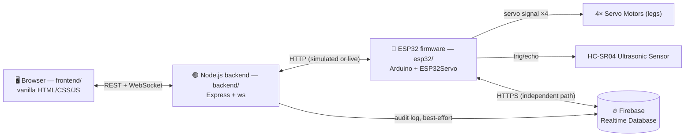

# 🤖 Smart Quadruped Robot — Interactive Research Companion

A Wi-Fi quadruped robot (ESP32 + 4 servos + HC-SR04) paired with a full web control platform: manual control, an AI chat/voice controller, a custom motion builder, autonomous obstacle-avoidance, and a Firebase-backed research log. Designed to run **today, with zero hardware**, via a built-in simulator — then go live on real hardware by flipping one setting.

> **Project identity:** an interactive companion that doubles as a lightweight academic/research assistant — every command and sensor reading it takes is preserved as data, not just displayed and forgotten.

---

## Table of Contents

1. [Features](#features)
2. [Architecture](#architecture)
3. [Hardware](#hardware)
4. [Software](#software)
5. [Complete Setup Checklist](#complete-setup-checklist)
6. [Project Roadmap](#project-roadmap)
7. [Design Decisions](#design-decisions-worth-knowing-about)
8. [Known Limitations](#known-limitations-read-this-before-a-demo)
9. [Troubleshooting](#troubleshooting)
10. [License](#license)

---

## Features

| Area | What it does |
|---|---|
| 🎮 **Manual Control** | 12 pose/gait buttons (Stand, Sit, Walk, Turn, Dance, Stretch, Wave, Sleep, Wake, Reset…) plus 4 live servo sliders |
| 💬 **AI Chat Control** | Type `"walk forward"`, `"walk 5 steps"`, `"turn left"`, `"move faster"`… parsed into commands with live execution progress |
| 🪄 **Motion Studio** | Step-based movement builder (servo, angle, speed, delay) with drag-to-reorder, save-by-name, and one-tap replay |
| 🧭 **Autonomous Navigation** | Walks forward on its own, reads the ultrasonic sensor every second, stops on obstacles, resumes when clear |
| 📊 **Status Dashboard** | Wi-Fi/ESP32 connection, robot state, servo angles, distance, last command, uptime, latency — refreshed live |
| 📜 **Logs** | Full command history with filtering, search, and live updates |
| 🛑 **Emergency Stop** | A dedicated, always-visible hardware-style stop control — click it, or press `Esc` anywhere |
| 🔥 **Firebase Research Log** | The ESP32 itself makes outgoing HTTP requests to Firebase — polls for remote commands, logs every reading as permanent research data |
| 🌗 **Theme, sound, toasts, shortcuts** | Dark/light mode, audio feedback, toast notifications, keyboard shortcuts (`Esc` = stop, arrow keys = movement) |

## Architecture



**The backend is the primary source of truth** for the local control path: the frontend never talks to the ESP32 directly, which is what makes simulation mode possible (`services/esp32Client.js` transparently fakes responses when no hardware is present). **Firebase is a second, independent path** — the ESP32 polls it for remote commands and logs data to it directly over HTTPS, satisfying "the microcontroller itself talks to a database" without interfering with the fast local path.

## Hardware

### Bill of Materials

| Component | Status | Role |
|---|---|---|
| ESP32 Dev Board | ✅ in kit | Main controller — runs the servos, sensor, Wi-Fi, and Firebase sync |
| 4× Servo Motors (e.g. SG90/MG90S) | ✅ in kit | One per leg (1 degree of freedom per leg) |
| HC-SR04 Ultrasonic Sensor | ✅ in kit | Obstacle detection |
| LEDs + resistors | ✅ in kit | Status/mood indicators (Roadmap Step 4) |
| Diodes | ✅ in kit | General protection use (optional in the current design) |
| Capacitors | ✅ in kit | Smooth the servo power rail — recommended: one ~470–1000µF electrolytic across the external 5V supply, near the servos |
| Small breadboard | ✅ in kit | Prototyping before any permanent wiring |
| Arduino Uno | ✅ in kit, **not used** | Its 2KB RAM and lack of Wi-Fi don't add anything the ESP32 doesn't already cover for this build — keep it for a separate project |
| 1× 1kΩ + 1× 2kΩ resistor | ✅ in kit | **Required** — HC-SR04 `ECHO` voltage divider (protects the ESP32's 3.3V-only GPIO from the sensor's 5V output) |
| External 5V / 2A+ power source | ❌ need to source | Powers the 4 servos — **do not** power them from the ESP32's own 5V pin. A dedicated USB power bank is the simplest safe option. See [Power Requirements](#power-requirements). |
| **Mechanical chassis / legs** |✅ in kit | a 3D-printed body for dog robot.
### Pin Map

| Signal | ESP32 GPIO | Note |
|---|---|---|
| Servo 1 | GPIO 22 | |
| Servo 2 | GPIO 21 | ⚠️ boot-strapping pin — see [Troubleshooting](#troubleshooting) if you get random resets |
| Servo 3 | GPIO 17 | |
| Servo 4 | GPIO 16 | |
| HC-SR04 `TRIG` | GPIO 5 | Direct connection is fine (3.3V read as logic-high) |
| HC-SR04 `ECHO` | GPIO 18 | **Through the voltage divider below — never direct** |

### Power Requirements

| Option | Voltage | Rating | Verdict |
|---|---|---|---|
| **USB power bank, dedicated to servos** | 5V | 2A+ | ✅ Recommended — simplest, safest, already regulated |
| 4× AA NiMH rechargeable pack | 4.8V | ~2000mAh | Fine, but voltage sags as it drains |
| 2S LiPo (7.4V) + 5V UBEC | 5V after conversion | UBEC 3A+ | Higher capacity, needs safe LiPo handling |
| Bench power supply | 5V | 2–3A | Best for calibration, not portable |

**Every ground must be common** — ESP32 `GND`, servo supply `GND`, HC-SR04 `GND` all tied together. Skipping this is the #1 cause of "nothing works" on a first power-up.

**Full wiring diagrams, the ECHO voltage-divider math, and an assembly checklist:** [docs/WIRING.md](docs/WIRING.md)

## Software

### Tech Stack

| Layer | Technology |
|---|---|
| Frontend | HTML, CSS, vanilla JavaScript — no build step, no framework |
| Backend | Node.js, Express, `ws` (WebSocket) |
| Firmware | Arduino framework for ESP32, `ESP32Servo`, `ArduinoJson`, `HTTPClient` |
| Database | Firebase Realtime Database (REST API — no SDK dependency, on either backend or firmware) |
| Communication | REST + WebSocket (dashboard ↔ backend), HTTP (backend/firmware ↔ ESP32 and ↔ Firebase) |

### Project Structure

```
smart-quadruped-robot/
├── frontend/              Static dashboard
│   ├── index.html, manual.html, chat.html, motion-studio.html,
│   │   autonomous.html, status.html, logs.html
│   ├── css/style.css      Design system (dark/light themes)
│   └── js/                api.js (REST+WS client), common.js (shell/theme/sound),
│                           one file per page
├── backend/                Node.js/Express server
│   ├── server.js           Entry point — serves frontend, mounts API, WS heartbeat
│   ├── config.js            Reads .env
│   ├── routes/               /move /servo /stop /chat /distance /status /logs /motions /autonomous
│   ├── services/              robotState, esp32Client, simulator, chatParser,
│   │                           logger, motionStore, autonomousService, firebaseClient
│   ├── ws/wsServer.js        Real-time push (telemetry / log / chat_progress)
│   └── data/                logs.json, motions.json (local persistence)
├── esp32/quadruped_robot/  Arduino sketch
│   ├── quadruped_robot.ino  WiFi, HTTP server, servos, sensor, Firebase sync
│   └── config.h              Pins, WiFi/Firebase credentials, pose calibration
├── assets/                 Shared logo/favicon
└── docs/                   API.md, WIRING.md, FIREBASE_SETUP.md
```

### Installation & Quick Start

**1. Run it now, in simulation (no hardware needed):**
```bash
cd backend
npm install
npm start
```
Open **http://localhost:3000** — the full dashboard works immediately against simulated sensor/servo data.

**2. Go live with real hardware**, once it's wired up (see [Hardware](#hardware) above):
- Open `esp32/quadruped_robot/quadruped_robot.ino` in Arduino IDE.
- Install board package **esp32** (Espressif Systems) and libraries **ESP32Servo** + **ArduinoJson** (v6.x) via Library Manager.
- Edit `esp32/quadruped_robot/config.h`: Wi-Fi credentials, pins (if different from the map above).
- Upload, then read the assigned IP from Serial Monitor (115200 baud).
- In `backend/.env` (copy from `.env.example`): set `SIMULATION_MODE=false` and `ESP32_IP=<that address>`.
- **Calibrate.** Pose/gait values in `config.h` are placeholders — tune them on your bench before trusting autonomous or chat-driven movement.

**3. Connect Firebase** (research log + remote control): follow [docs/FIREBASE_SETUP.md](docs/FIREBASE_SETUP.md), then set `FIREBASE_DATABASE_URL` in `backend/.env` and `FIREBASE_HOST` in `esp32/quadruped_robot/config.h`.

### Configuration Reference

| Setting | Where | Default | Purpose |
|---|---|---|---|
| `PORT` | `backend/.env` | `3000` | Backend/dashboard port |
| `SIMULATION_MODE` | `backend/.env` | `true` | `false` = talk to a real ESP32 |
| `ESP32_IP` | `backend/.env` | `192.168.1.50` | Only used when `SIMULATION_MODE=false` |
| `SAFE_DISTANCE_CM` / `WARNING_DISTANCE_CM` | `backend/.env` | `30` / `60` | Obstacle danger/warning thresholds |
| `FIREBASE_DATABASE_URL` | `backend/.env` | *(blank = disabled)* | Backend's Firebase audit-log target |
| `WIFI_SSID` / `WIFI_PASSWORD` | `esp32/config.h` | placeholders | ESP32's network credentials |
| `SERVO1_PIN` … `SERVO4_PIN`, `TRIG_PIN`, `ECHO_PIN` | `esp32/config.h` | see [Pin Map](#pin-map) | Physical wiring |
| `FIREBASE_HOST` | `esp32/config.h` | placeholder | ESP32's Firebase sync target (host only, no `https://`) |
| `POSE_STAND` / `POSE_SIT` / `POSE_SLEEP` / `POSE_STRETCH` | `esp32/config.h` | neutral placeholders | **Calibrate these for your robot** |

### API & Firebase Reference

- Full REST + WebSocket reference: [docs/API.md](docs/API.md)
- Firebase schema, console setup, and security rules: [docs/FIREBASE_SETUP.md](docs/FIREBASE_SETUP.md)

## Complete Setup Checklist

A single ordered path from zero to a calibrated, Firebase-connected robot:

**Phase 1 — Software only**
1. Install Node.js, `npm install && npm start` in `backend/`, explore the dashboard in simulation.
2. Create the Firebase project, get the database URL, set it in `backend/.env`, confirm data appears in the Firebase console.

**Phase 2 — Hardware assembly**
3. Gather all Bill-of-Materials items, **including the chassis** (longest lead time item).
4. Wire per [docs/WIRING.md](docs/WIRING.md) — grounds first, then the ECHO voltage divider, then everything else.
5. Install Arduino IDE + esp32 board package + ESP32Servo + ArduinoJson.
6. Set Wi-Fi credentials in `config.h` (leave `FIREBASE_HOST` as the placeholder for now), upload, confirm connection + note the IP via Serial Monitor.
7. Set `SIMULATION_MODE=false` + `ESP32_IP` in `backend/.env`, restart the backend.
8. Test every Manual Control button on real hardware; calibrate pose/gait values in `config.h` until movement looks right.

**Phase 3 — Firebase on real hardware**
9. Set the real `FIREBASE_HOST` in `config.h`, re-upload, confirm "Firebase sync enabled" in Serial Monitor.
10. Test `POST /api/move/remote` and confirm the robot executes it and clears the entry in Firebase.

**Phase 4 — Remaining roadmap features** (see below), one at a time.

**Phase 5 — Demo prep**: final documentation pass, rehearsal.

## Project Roadmap

Toward the "interactive research companion" identity:

- [x] **Step 1 — Firebase Foundation.** ESP32 makes real outgoing HTTPS requests to Firebase.
- [x] **Step 2 — Voice-to-Text Chat.** Microphone input on the AI Chat page (Web Speech API), transcripts saved to Firebase.
- [x] **Step 3 — Research Sessions.** Named sessions grouping readings/interactions for later review.
- [x] **Step 4 — Personality.** LED mood indicators, an interaction counter.
- [x] **Step 5 — Calibration & final polish.**

## Design Decisions Worth Knowing About

- **Simulation-first.** `backend/services/simulator.js` stands in for the ESP32 by default, so the whole app is demoable and testable without hardware.
- **One action per `/move` call.** Multi-step commands (like "walk 5 steps" from chat) are multiple calls in a row, not one long blocking sequence — this keeps every ESP32 request short, which is what keeps Emergency Stop responsive.
- **Obstacle safety is enforced twice, independently.** The backend (simulation) and the firmware (real hardware) each refuse a "walk forward" while an obstacle is within `SAFE_DISTANCE_CM`.
- **Chat is rule-based, not an LLM call.** Fast, free, fully offline, but its input/output contract is kept stable so it can be swapped for a real LLM later without touching route code.
- **Emergency Stop is a dedicated endpoint**, not a value of the generic `/move` command, so it can never be blocked by unrelated validation logic.
- **Firebase commands and local commands never overlap.** `/api/move` (local, fast) and `/api/move/remote` (Firebase, works from anywhere) write to different paths specifically so the ESP32 can never execute the same command twice.

## Known Limitations (read this before a demo)

- Gait angles are illustrative placeholders — an un-calibrated physical robot will not walk correctly out of the box.
- ESP32 motion uses short blocking `delay()` calls for simplicity/readability; a stricter real-time design would use a separate FreeRTOS task or `ESPAsyncWebServer`.
- Autonomous mode stops on obstacles but doesn't turn to avoid them or build a map — a good next feature.
- Firebase calls use `setInsecure()` (skips TLS certificate validation) to keep the course project simple. Fine for a local demo, not for anything production-facing.
- No mechanical chassis is included or specified — see the Bill of Materials.

## Troubleshooting

| Symptom | Likely cause | Fix |
|---|---|---|
| ESP32 randomly reboots when moving | Servo current sagging shared power rail | Separate 5V supply for servos, common ground, add a smoothing capacitor |
| Random resets / boot loops right after flashing | GPIO 12 is a boot-strapping pin | Move Servo 2 to another free pin (e.g. GPIO 4) in `config.h` if this happens |
| HC-SR04 gives wildly wrong readings | Missing/wrong voltage divider on `ECHO` | Rebuild the 1kΩ/2kΩ divider, verify ~3.3V with a multimeter before connecting |
| Dashboard shows "ESP32 Offline" | `SIMULATION_MODE` still `true`, or wrong `ESP32_IP` | Check `backend/.env`, confirm the IP from Serial Monitor |
| ESP32 Serial Monitor says "Firebase sync DISABLED" | `FIREBASE_HOST` still the placeholder | Set it in `config.h`, matching your `.env`'s `FIREBASE_DATABASE_URL` host |
| Robot walks in the wrong direction | Gait sign pattern doesn't match your servo mounting | Flip the `+`/`-` signs in `doWalkForward()` etc. in the `.ino` |
| `npm start` fails immediately | Dependencies not installed | Run `npm install` inside `backend/` first |

## License

MIT — see [LICENSE](LICENSE).
